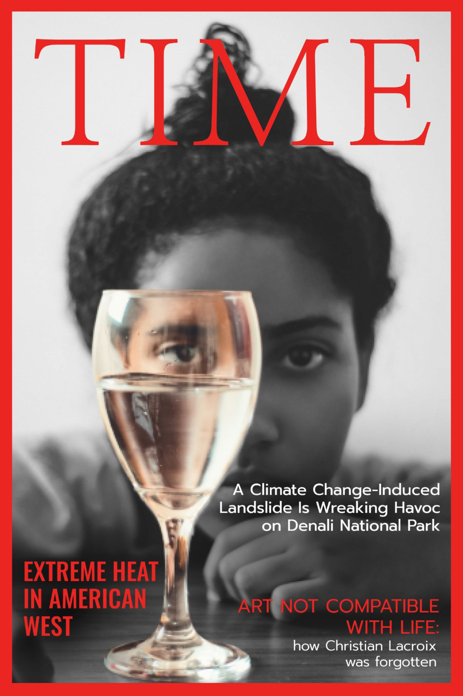

 <h1>Where are we standing and why it is important to create campains?</h1> 

>“Global warming is likely to be the greatest threat of the 21st century.” 

As you all know, climate change refers to long-term shifts in temperatures and weather patterns. These shifts can be natural, such as through variations in the solar cycle. 
Nevertheless, since the 1800s, human activities have been the [main driver of climate change](https://www.ipcc.ch/site/assets/uploads/sites/2/2018/12/ST1.5_OCE_LR.pdf), more precisely in global warming. Indeed, in the last decades we observe a general increase in average temperatures of the Earth, which modifies the weather balances and ecosystems. At the pace of current CO2 emissions, scientists expect an increase of between 1.5° and 5.3°C in average temperature by 2100. If no action is taken, it would have harmful consequences to humanity and the biosphere. 

If you encounter climate skeptics in your way, you will find useful arguments [here](https://350.org/fr/). 

All these previous scientific facts need to be vulgarized and reach the general population to all act in an eco-responsible way in their daily life.  Public awareness is important to increase enthusiasm and support, simulate self-mobilisation and action, and mobilise local knowledge and resources. Raising political awareness is important as policy makers and politicians are key actors in the policy process of adaptation. 

## Goal

We want to create a productive awareness campaign about Climate Change. Thanks to “Quotebank '' database and open accessible data, our goal is to understand how the Climate Change topic has been appropriated by society in the last 5 years. In other words, when do we talk about it, who and in which platform? This article should serve as a head start for people searching how to target the Climate Change awareness campaign.

## Research Questions
During this article we will anwser to the following questions:
* What were the topics and events that triggered conversation about Climate Change?
* Who are the main personalities driving Climate Change topic? 
* Are there medias appropriating Climate Change theme? Is Climate Change "IN"? 

## How we did it
We built our dataset from Quotebank, an open corpus of 178 million quotations attributed to the speakers who uttered them, extracted from 162 million English news articles published between 2008 and 2020. Additionally, we only take Climate Change

We wanted to have as much data as possible to have an accurate analysis. So we have in total: 

       Quotes                            Speakers                            Domains  
       142'238                            50'154                              6'673 

#### Let’s check now what the data has to say... 

 <h1>Which events triggers conversion about Climate Change?</h1> 

{: .box-note}
**Assumption:** There is a linear relationship between quotes and articles in online newspapers. Thus if we interchange both words, don't be surprised. 

### Frecuency of Climate Change Quotes 
Graph occurences through time
Do Climate Change quotes appear in the frequency though time? No! There is a heterogenouty, either quotes are published hundred of times in differents news papers either they appear few time. How come? 

Let's start really brodly by analysing the evolution of climate change quotes in the last 5 years. 
GRAPH Time VS number of quotes
A major pic appears in April 2017, what happend then? 

### Main Topics of Climate Change 
 
{: .box-note}
**Side Note:** Thanks to LDA we are aible to determine different topics in Climate Change Quotes! 
 

 
 
### Is there a difference of frequency of before and after X event?
 Lalala
 
### Topic Trough time
 
<iframe src='https://flo.uri.sh/visualisation/8142851/embed' title='Interactive or visual content' class='flourish-embed-iframe' frameborder='0' scrolling='no' style='width:100%;height:600px;' sandbox='allow-same-origin allow-forms allow-scripts allow-downloads allow-popups allow-popups-to-escape-sandbox allow-top-navigation-by-user-activation'></iframe>

This could already give us a hint of topics that people are interestd about! 

Are there topics that appear in a pattern? 

 <h1>Who talks about Climate Change? </h1> 

Let’s now look into people that are most quoted in relation to Climate Change from the past 5 years.
_Are the most quoted people for Climate Change talk only about Climate Change?_

<table align="center" style="text-align:center">
 <tr><th>Position  </th> <th>Speaker</th>         <th>% over all Speaker quotes </th></tr>
 <tr><td> 1 </td>   <td> Barack Obama </td>        <td> 32.8 % </td></tr>
 <tr><td> 2 </td>   <td> Bernie Sanders </td>      <td> 40.9 % </td></tr>
 <tr><td> 3 </td>   <td> Donald Trump  </td>       <td> 16.4 % </td></tr>
 <tr><td> 4 </td>   <td> Narendra Modi  </td>      <td> 29.4 % </td></tr>
 <tr><td> 5 </td>   <td> António Guterres </td>    <td> 27.7 % </td></tr>
 <tr><td> 6 </td>   <td> Jay Inslee</td>           <td> 29.8 % </td></tr>
 <tr><td> 7 </td>   <td> Michael Mann </td>        <td> 40.3 % </td></tr>
 <tr><td> 8 </td>   <td> Justin Trudeau  </td>     <td> 19.4 % </td></tr>
 <tr><td> 9 </td>   <td> Jerry Brown </td>         <td> 20.4 % </td></tr>
 <tr><td> 10 </td>  <td> Al Gore </td>             <td> 24.5 % </td></tr>
 </table>   
 

 
 **Table 1:** Top most quoted speaker and their percentage of citation on Climate Change out of their total citation. 

It seems that is not the case, but still it is a hot topic! 

Do you see a trend between most quoted speakers?

#### We will help you: 
 
 ADD A IMAGE WITH PLOT OF DIFFERENTS FEATURES 
The “type” person that is most quoted about the climate change is: 
 
ADD IMAGE PEARSON WITH PIE CHARTS OF OCCUPATION, SEX, NATIONALITY,  RACE AND RELEGION

Most people quoted seem to be political. Indeed the following graph will show you what the occupation of most quoted people is. But let’s go further 

(tals about politics? Embedding? ) 

Ok, so in conclusion if you are  politic with this and this age nationality and , be sure that you will be hearded. 

 <h1>What are the medias that publish the most Climate Change related topic?</h1> 

Finally, what will be the most eficient media to talk about Climate Change? 
Is it _Time_ as the poster could advance? 

Let's play with embeddings, the hottest thing of the century !

<iframe src='https://projector.tensorflow.org/?config=https://gist.githubusercontent.com/vminvsky/45b24d87668ee39c42ed431e2a510696/raw/a89a3cb6d46d9baf7ae5c6001ee07613f1c94353/quotebank_embedding' title='Interactive or visual content' width="100%" height="600px" ></iframe>
 
 And....
 


 <h1>Conclusion and Implication</h1> 

